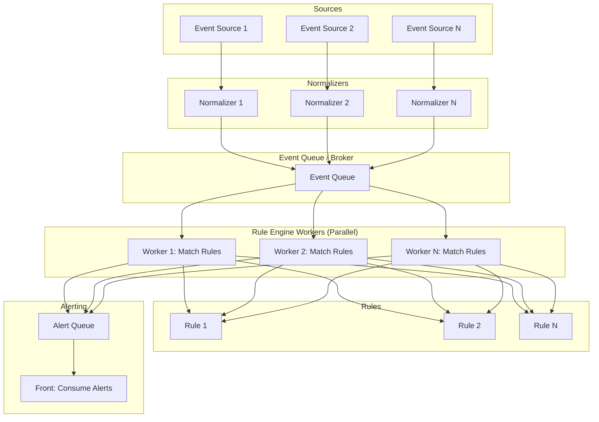
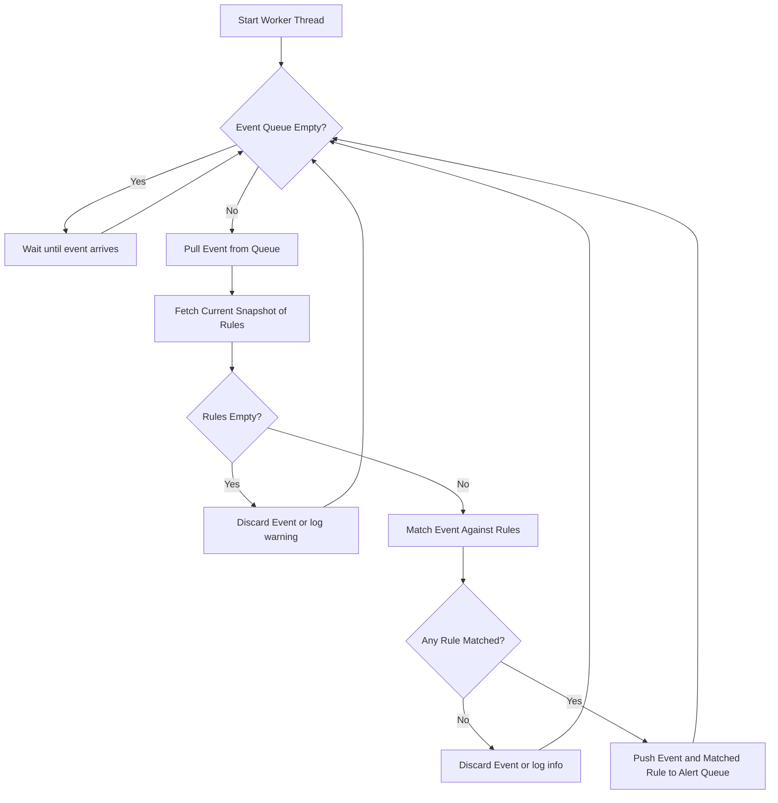

# Для работы
Текущий продукт является матчером правил, и поставляется только с 
примером в виде адаптера для sysmon.
На конечном устройстве деплоитьs sysmon потребуется юзеру самому. 
Для инструкций по установке и настройке sysmon 
обращайтесь к [оффициальной инструкции по sysmon](https://learn.microsoft.com/en-us/sysinternals/downloads/sysmon)
# Для компиляции
Нужно установить библиотеки
- glfw3
- opengl

После этого можно компилировать всё остальное

## Уточнения
### Для windows
1. установить библиотеки через vcpkg
2. В CMakePresets.json обновить VCPKG_ROOT значение переменной на свой путь к vcpkg

### Для linux 
1. установить библиотеки через любой доступный packet manager

[logsource resolution](https://github.com/SigmaHQ/sigma/blob/1751ef8673365444ae44eb38887d3025982f4794/documentation/logsource-guides/windows/category/process_creation.md#category-process_creation)

Detection by
- [ ] Keyword
- [ ] Field
- [ ] Field list

Conditions
- [ ] not
- [ ] and
- [ ] or
- [ ] brackets
- [ ] 1 of ()
- [ ] all of ()
- [ ] 1 of them
- [ ] all of them

modifiers: https://sigmahq.io/docs/basics/modifiers.html#available-field-modifiers
https://habr.com/ru/companies/pt/articles/513032/ utf handling

Required
- detection
- logsource
- title

Optional if im very cool (Meta rules)
- Correlations
- Filters

About parsing events on windows:  
Clarification on Windows events from the EventViewer:  
Some fields are defined as attributes of the XML tags (in the <System> header of the events). The tag and attribute names have to be linked with an underscore character '_'.  
In the <EventData> body of the event the field name is given by the Name attribute of the Data tag.
https://github.com/SigmaHQ/sigma-specification/blob/main/specification/sigma-rules-specification.md#detection  

# Diagrams

## General flow

## Worker flow

